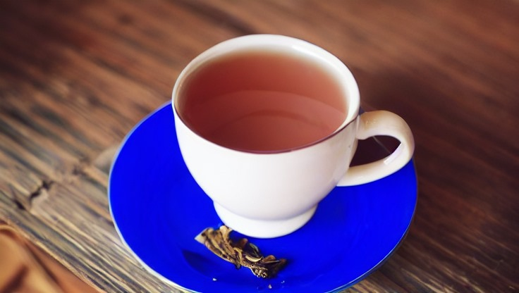

# Ad Creator | Stable Diffusion Img2Img

Backend'i host etmek için Azure'da öğrencilik zamanımdan kalan kredimi kullandım. Bu sebeple GPU'lu bir instance seçemedim. CPU'da çalıştığı için Task 1 inference'ı API ile yaklaşık 15 dakika sürmektedir.

Daha hızlı test etmek isterseniz Colab'te GPU ile çalıştırabilceğiniz bir notebook hazırladım. [Demo Notebook](Demo-Notebook.ipynb)

## Task 1:
- <b>Input:</b> Image (png), Prompt (text), Renk (hex code)</br>
- <b>Output:</b> Image</br>

<b>Endpoint:</b> http://20.199.117.80:5000/generate-image

Model olarak huggingface'ten "runwayml/stable-diffusion-v1-5" modelini kullandım. Parametre olarak verilen rengin output'ta olmasını sağlamak için 3 yöntem denedim.

<b>1\. Yöntem:</b> modele verilen promptun sonun bu rengi de kullan gibi bir eklenti yaparak kullandırmayı denedim ancak her zaman işe yarayan bir çözüm değildi.

<b>2\. Yöntem:</b> input'a hex code olarak aldığım rengi gaussian noise olarak ekleyip sonrasında Stable diffusion modelinden geçirdim. Burda da iyi bir çıktı elde edemedim.

<b>3\. Yöntem:</b> Son olarak Meta'nın Segment Anything Model'ini kullanarak parametre olarak aldığım query'i burda da kullanarak input'tan objeyi seçtirttim. SAM yavaş çalıştığı için daha sonrasında FastSAM modelini kullanarak devam ettim. Daha sonra bu objeyi parametre olarak alınan hex code ile tamamen boyadım ve Stable Diffusion modelinden boyandıktan sonra geçirdim. Çıktılarda başarılı bir şekilde verilen rengi de dahil etmiş oldum. Ancak verilen query'i kulanmak her case için uygun olmayabilir iyileştirmelere açıktır.

### Örnek API ile Kullanım:
```bash
curl -X POST -F "prompt=cup of tea" -F "color=#0000FF" -F "image=@C:/Users/ASUS/Downloads/img/kahve.png" http://20.199.117.80:5000/generate-image --output "C:/Users/ASUS/Downloads/img/output_image.png"
```

### Örnek input ve outputlar:

<b>Input:</b></br>
</br>
<b>HEX: <i> #0000FF </i> (Mavi)</b></br>
<b>Prompt: <i> cup of tea </i></b></br>

<b>Örnek mask ve Çıktılar</b> (burda mask'i prompt'u kullanarak seçmek yerine tüm mask'lar arasından kendim birini seçip denemiştim):</br>

<b>Mask:</b></br>
</br>

<b>Modelden geçirmeden önceki boyama işlemi:</b></br>
</br>

<b>Output:</b></br>
</br>

<b>Mask:</b></br>
</br>

<b>Boyama:</b></br>
</br>

<b>Output 1:</b></br>
</br>
<b>Output 2:</b></br>
</br>


<b>Input:</b></br>
</br>
<b>HEX: <i> #00FF00 </i> (Yeşil)</b></br>
<b>Prompt: <i> cup of tea </i></b></br>
<b>Output:(Promptu kullanarak modelin kendi seçtiği versiyon)</b></br>
</br>

<b>Input:</b></br>
</br>
<b>HEX: <i> #00FF00 </i> (Yeşil)</b></br>
<b>Prompt: <i> cup of tea </i></b></br>
<b>Output:(Promptu kullanarak modelin kendi seçtiği versiyon)</b>
</br>


## Task 2:
- <b>Input:</b> Task 1’deki image, Logo (png), Renk (hex code), Punchline (text), Button (text)</br>
- <b>Output:</b> Image (png veya svg)</br>

<b>Endpoint:</b> http://20.199.117.80:5000/generate-ad

HTML ve CSS kullanarak bir template hazırladım. alınan parametreleri template e koyarak HTML'den PDF olarak renderladım. Daha sonra PDF'ten PNG'ye çevirerek outputu oluşturdum. (Punchline ve buton yazsısı uzadıkça otomatik alt satıra geçmekte.)

### Örnek API ile kullanım:
```bash
curl -X POST -F "punchline=Punchline aasdfasd asf dasdfas as fasf as fasfd asdf as fas fasdf asdf asdf asd fas" -F "button_text=Press Me! gsdfgsdfgsdfg sgsdgfsdfgsdfg sdfgdsfgdsfgdsfg dsgdsfgdsfgsdfgsdfg sdfgsdfgsdfg" -F "color=#00FF00" -F "image=@C:/Users/ASUS/Downloads/img/ad_input.png" -F "logo=@C:/Users/ASUS/Downloads/img/logo.png" http://20.199.117.80:5000/generate-ad --output "C:/Users/ASUS/Downloads/img/ad_output.png"
```
Yazılar satıra sığmadığında alt satıra geçtiğin göstermek için yazıları uzun girdim.
### Örnek input ve output:
<b>Input:</b></br>
</br>
<b>Logo:</b></br>
</br>
<b>HEX: <i> #00FF00 </i> (Yeşil)</b></br>
<b>Punchline: <i> Punchline aasdfasd asf dasdfas as fasf as fasfd asdf as fas fasdf asdf asdf asd fas  </i></b></br>
<b>Button Text: <i> Press Me! gsdfgsdfgsdfg sgsdgfsdfgsdfg sdfgdsfgdsfgdsfg dsgdsfgdsfgsdfgsdfg sdfgsdfgsdfg  </i></b></br>
<b>Output:</b>


## Task 3:

En başta bahsettiğim gibi Azure'da Virtual Machine kullanarak deploy ettim. Backend için Flask kullandım. HTML'den PDF'e ve PDF'ten PNG'ye çevirme işleminin Windows cihazlarda çalışabilmesi için gerekli olan DLL dosyalarını libs klasörü altına ekledim. Program çalışırken kendisi otomatik olarak algılamaktadır.

<b>Endpoint:</b> http://20.199.117.80:5000/generate-image </br>
<b>Endpoint:</b> http://20.199.117.80:5000/generate-ad

Daha hızlı test etmek için Colab'te GPU ile çalıştırabilceğiniz notebook'u kullanmanızı öneririm. [Demo Notebook](Demo-Notebook.ipynb)
